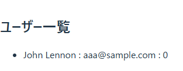
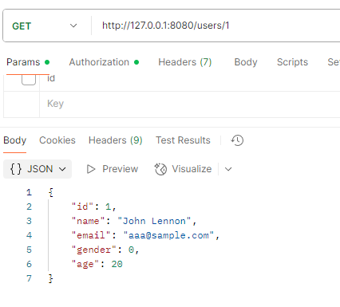

# openAPI 導入手順/運用手順

## 前提

- [openAPI](https://swagger.io/specification/)とは、RESTful API の仕様書を記述するための標準仕様
  - yml ファイルにて記載する
    - preview 見ながら執筆する事も可能
    - GUI での執筆も可能
  - 仕様書として整ったフォーマットで出力できる
    - [sample(定義)](./openapi-spec/openapi.yml)
    - [sample(成果物)](./openapi-spec/index.html)
- [openapi-generator](https://github.com/OpenAPITools/openapi-generator)とは、openAPI の定義に従って型定義と http リクエストのコードを自動生成するツール
  - 桁数や必須かどうか程度の validation も定義可能
- [prism](https://stoplight.io/open-source/prism)とは、openAPI の定義から mock-server を立てる事が出来るツール

## メリット

- 仕様書のフォーマットが整う
- 工数短縮
- 仕様の整合性が取れる

## 導入

### backend

- openapi-generator の適用
- `generated-resources`タスクを実行すると`./target/generated-sources` 配下にコードが生成される
- api ごとに interface が切られるので、implements して中身を実装

  - interface

  ```Java
  public interface UsersApi {
      /**
       * GET /users/{id} : ユーザー詳細取得
       * ユーザーの一覧を取得します。指定されたパラメータでフィルターします。
       *
       * @param id  (required)
       * @return OK (status code 200)
       */
      @Operation(
          operationId = "getUserById",
          summary = "ユーザー詳細取得",
          description = "ユーザーの一覧を取得します。指定されたパラメータでフィルターします。",
          tags = { "user" },
          responses = {
              @ApiResponse(responseCode = "200", description = "OK", content = {
                  @Content(mediaType = "application/json", schema = @Schema(implementation = User.class))
              })
          },
          security = {
              @SecurityRequirement(name = "bearerAuth")
          }
      )
      @RequestMapping(
          method = RequestMethod.GET,
          value = "/users/{id}",
          produces = { "application/json" }
      )

      default ResponseEntity<User> getUserById(
          @Parameter(name = "id", description = "", required = true, in = ParameterIn.PATH) @PathVariable("id") Integer id
      ) {
          getRequest().ifPresent(request -> {
              for (MediaType mediaType: MediaType.parseMediaTypes(request.getHeader("Accept"))) {
                  if (mediaType.isCompatibleWith(MediaType.valueOf("application/json"))) {
                      String exampleString = "{ \"gender\" : 0, \"name\" : \"John Lennon\", \"id\" : 1, \"email\" : \"aaa@sample.com\", \"age\" : 20 }";
                      ApiUtil.setExampleResponse(request, "application/json", exampleString);
                      break;
                  }
              }
          });
          return new ResponseEntity<>(HttpStatus.NOT_IMPLEMENTED);

      }
  }
  ```

  - 実装

  ```Java
  public class Users implements UserApi {
      /**
       * GET /users/{id} : ユーザー詳細取得 の実装
       *
       * @param id ユーザーID (パスパラメータ)
       * @return 指定されたIDのユーザー情報を返却
       */
      @Override
      public ResponseEntity<User> getUserById(Integer id) {
          User user = new User();
          user.setId(id);
          user.setName("John F Kennedy");
          user.setEmail("john@example.com");
          user.setAge(46);
          user.setGender(Gender.male); // 0: 男性

          // HTTPステータス200 (OK)
          return ResponseEntity.ok(user);
      }
  }
  ```

  - 型定義

  ```Java
  /**
   * User
  */

  @Generated(value = "org.openapitools.codegen.languages.SpringCodegen", date = "2025-08-05T07:02:33.099354500+09:00[Asia/Tokyo]", comments = "Generator version: 7.6.0")
  public class User {

  private Integer id;

  private String name;

  private String email;

  private Gender gender;

  private Integer age;

  public User() {
      super();
  }

  /**
  * Constructor with only required parameters
  */
  public User(String name, String email) {
      this.name = name;
      this.email = email;
  }

  public User id(Integer id) {
      this.id = id;
      return this;
  }

  /**
  * ユーザーID
  * minimum: 1
  * @return id
  */
  @Min(1)
  @Schema(name = "id", example = "1", description = "ユーザーID", requiredMode = Schema.RequiredMode.NOT_REQUIRED)
  @JsonProperty("id")
  public Integer getId() {
      return id;
  }

  public void setId(Integer id) {
      this.id = id;
  }

  public User name(String name) {
      this.name = name;
      return this;
  }

  /**
  * 氏名
  * @return name
  */
  @NotNull @Size(min = 3, max = 50)
  @Schema(name = "name", example = "John Lennon", description = "氏名", requiredMode = Schema.RequiredMode.REQUIRED)
  @JsonProperty("name")
  public String getName() {
      return name;
  }

  public void setName(String name) {
      this.name = name;
  }

  public User email(String email) {
      this.email = email;
      return this;
  }
  ～(後略)～
  ```

- (参考)https://openapi-generator.tech/docs/generators/spring

## frontend

- openapi-generator の適用
- `npm run generate-code`を実行すると`./generated-sources` 配下にコードが生成される

- (参考)https://openapi-generator.tech/docs/generators/typescript-axios

- openapi-generator の適用
- http request のコード

  - axios parameter creator
    - fetch 前提
    - parameter の定義のみ自動生成されたコードを使用
    ```ts
    import { UserApiAxiosParamCreator } from "hogehoge";
    const paramCreator = UserApiAxiosParamCreator();
    const userRequestArgs = await paramCreator.getUsers();
    const response = await fetch(userRequestArgs.url, userRequestArgs.options);
    ```
  - functional programming interface
    - 関数型
    ```ts
    const request = await UserApiFp().getUsers();
    const response = await request();
    ```
  - factory interface

    - factory 関数

    ```ts
    import { UserApiFactory } from "hogehoge";
    import myCustomAxios from "fugafuga";
    const usersApi = UserApiFactory(
      undefined,
      "http://localhost:8080",
      myCustomAxios
    );

    const response = await usersApi.getUsers();
    ```

  - object-oriented interface
    - クラスで定義
    ```ts
    const usersApi = new UserApi({ basePath: "http://localhost:8080" });
    const response = await usersApi.getUsers();
    ```

- 設定値

```

{
"withSeparateModelsAndApi": true, // タグごとに整理
"useSingleRequestParameter": true, //引数を object にまとめる
"stringEnums": true, //文字列の列挙型を enum で管理
"apiPackage": "api",　// http リクエストのコードの出力パス
"modelPackage": "models" //型定義のコードの出力パス
}

```

- mock-server の実行
  - `npm run mock`で 8080 で実行される
  - bearer は任意の文字列




## c#

- (参考)https://openapi-generator.tech/docs/generators/csharp
- HTTP リクエスト

  ```csharp
  public interface IItemsApiSync : IApiAccessor
      {
          #region Synchronous Operations
          /// <summary>
          /// 商品一覧取得API
          /// </summary>
          /// <remarks>
          /// 商品一覧を取得する
          /// </remarks>
          /// <exception cref="sample.Client.ApiException">Thrown when fails to make API call</exception>
          /// <returns>Items</returns>
          Items GetItems();

          /// <summary>
          /// 商品一覧取得API
          /// </summary>
          /// <remarks>
          /// 商品一覧を取得する
          /// </remarks>
          /// <exception cref="sample.Client.ApiException">Thrown when fails to make API call</exception>
          /// <returns>ApiResponse of Items</returns>
          ApiResponse<Items> GetItemsWithHttpInfo();
          #endregion Synchronous Operations
      }
  ```

  - 型定義

  ```csharp
  namespace sample.Model
  {
      /// <summary>
      /// User
      /// </summary>
      [DataContract(Name = "User")]
      public partial class User : IValidatableObject
      {

          /// <summary>
          /// Gets or Sets Gender
          /// </summary>
          [DataMember(Name = "gender", EmitDefaultValue = false)]
          public Gender? Gender { get; set; }
          /// <summary>
          /// Initializes a new instance of the <see cref="User" /> class.
          /// </summary>
          [JsonConstructorAttribute]
          protected User() { }
          /// <summary>
          /// Initializes a new instance of the <see cref="User" /> class.
          /// </summary>
          /// <param name="id">ユーザーID.</param>
          /// <param name="name">氏名 (required).</param>
          /// <param name="email">メールアドレス (required).</param>
          /// <param name="gender">gender.</param>
          /// <param name="age">年齢.</param>
          public User(int id = default, string name = default, string email = default, Gender? gender = default, int age = default)
          {
              // to ensure "name" is required (not null)
              if (name == null)
              {
                  throw new ArgumentNullException("name is a required property for User and cannot be null");
              }
              this.Name = name;
              // to ensure "email" is required (not null)
              if (email == null)
              {
                  throw new ArgumentNullException("email is a required property for User and cannot be null");
              }
              this.Email = email;
              this.Id = id;
              this.Gender = gender;
              this.Age = age;
          }
          ～(後略)～


  ```

## 運用

### 運用手順

1. openAPI の定義を更新
2. 仕様書として出力
3. 各使用先で最新を取得
   - Git の submodule 想定
4. 各使用先でコード生成(用意したコマンドを叩くのみ)

### 仕様書の生成

## openAPI の記法について

- 型定義があるがリクエストやレスポンスで使われない場合、型定義は出力されない
  - 型定義のみ使いたい場合(enum など)、ダミーの API を作成して参照する
    - `/_reference`などの配下に作成
  - 周知の意識は必要

### 注意点

- root の openapi.yml のみに記載するとファイルが膨れ上がってメンテナンスが悪いため、#ref で定義ファイルは分割する
  - paths/：エンドポイントの定義
  - schamas/：型定義
